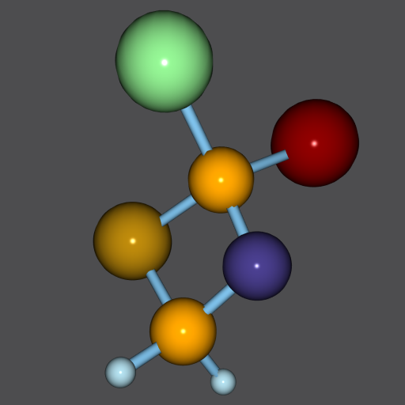

# COCR

[](./LICENSE.md)
[](./docs/Build_wasm.md)
[](./docs/Build_android.md)
[](./docs/Build_desktop.md)
[](./docs/Build_desktop.md)
[](./docs/Build_desktop.md)

**COCR** is designed to convert an image of **hand-written** chemical structure to **graph** of that molecule.

COCR, **O**ptical **C**haracter **R**ecognition for **C**hemical Structures, was once a demo for my undergraduate
graduation thesis in 2021.6. It brings OCSR(optical chemical structure recognition) capability into handwriting cases.
Below is a summary of supported items.

|symbol|strings|rings|solid wedge|hash wedge|wavy bond|single bond|double bond|triple bond|
|:----:|:----:|:----:|:----:|:----:|:----:|:----:|:----:|:----:|
|looks like|**(CH<sub>2</sub>)<sub>2</sub>COOEt**|**⏣**|**▲**|**△**|**~~**|**/**|**//**|**///**|
|supported|✔️|✔️|✔️|✔️|✔️|✔️|✔️|✔️|

COCR is developed under Qt framework. It handles images with YOLO and CRNN models using opencv or ncnn backend.

In this repository, you can find stable version from [release pages](https://github.com/xuguodong1999/COCR/tags). Master
branch is under development as it is not robust enough yet.

## Features

### v1.1

* Add support on strings and wavy bond.

### v1.0

|Input|Detection|Render|
|:----:|:----:|:----:|
||||

* Support single element symbols: C、H、O、N、P、B、S、F、Cl、Br、I.
* Support bond types: single, double, triple, hash wedge, solid wedge, circle.

## Architecture

[Flow Chart](./docs/Module.md)

## Build from source

OpenCV ≥4.5.1, Qt =5.15.2 are required for a minimal build.

```shell
git clone https://github.com/xuguodong1999/COCR.git
cd COCR && mkdir build && cd build

cmake .. -G "Ninja" \
  -DQt5_DIR:PATH=path/to/Qt/5.15.2/gcc_64/lib/cmake/Qt5 \
  -DOpenCV_DIR:PATH=path/to/opencv4/lib/cmake/opencv4

cmake --build . --parallel --config Release --target leafxy
```

[Build opencv from source](./docs/Config_opencv.md)

[Build libtorch from source](./docs/Config_libtorch.md)

## Data generation

COCR uses [SCUT-COUCH2009](https://www.hcii-lab.net/data/scutcouch/CN/couch.html) as meta handwriting data, and uses
  QtGui::QTextDocument as rich text renderer.

A chemical structure generator for handwriting cases is written to provider training data for YOLO and CRNN models,
  which composes meta-character into random chemical structure formulas. You can find related codes under src/data_gen.

After a minimal build above, a data_gen(.exe) can be found under $(BUILD_DIR)/out. There are following usages:

1. Double click or run from shell WITHOUT arguments

```txt
this will display samples with cv::imshow
```

2. Run with -yolo [number of samples] [an empty, existing directory path], for example,

```shell
# generate 10 object detection samples under ./yolo/
./data_gen -yolo 10 ./
```

3. Run with -crnn [number of samples] [an empty, existing directory path], for example,

```shell
# generate 10 text recognition samples under ./crnn/
./data_gen -crnn 10 ./
```

4. Run with -isomer [number of samples] [an empty, existing directory path], for example,

```shell
# generate all alkane isomers for C-num ≤ 16 namely {CARBON_NUM}.dat under ./
# dont play with number over 20 without taking a look at src/data_gen/isomers.cpp.
# it may comsume a lot of memory and cpus.
./data_gen -isomer 16 ./
```

## License

[GPLv3 Clause](./LICENSE.md)
